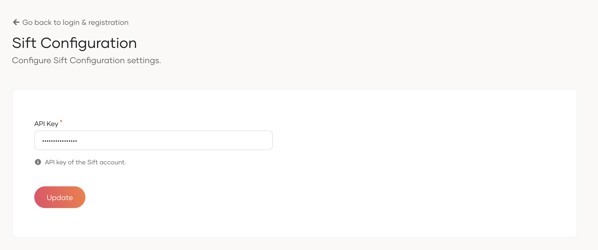

# Configuring Sift Fraud Detection

To use the Sift fraud detection with WSO2 Identity Server, first you need to configure Sift connector with WSO2 Identity Server. 
See the instructions given below on how to configure Sift fraud detection with WSO2 Identity Server.

## Prerequisites
To use the connector you need to have a Sift account. 
If you do not have an account, you can create one by visiting the [Sift website](https://sift.com/).

## Installing the Sift connector

**Step 1:** Extracting the project artifacts
1. Clone the `identity-fraud-sift-int` repository.
2. Build the project by running ```mvn clean install``` in the root directory.

Note : The latest project artifacts can also be downloaded from the Connector Store.

**Step 2:** Deploying the Sift connector

1. Navigate to the `identity-fraud-sift-int/components/org.wso2.carbon.identity.fraud.detection.sift/target` directory.
2. Copy the `org.wso2.carbon.identity.fraud.detection.sift-<version>-SNAPSHOT.jar` file to the `<IS_HOME>/repository/components/dropins` directory.
3. Restart the WSO2 Identity Server.

## The WSO2 console's UI for the Sift connector

The WSO2 Console's UI for the Sift connector enables developers to easily configure Sift for their organization. 
The UI offers a user-friendly and intuitive interface for defining Sift API key.

Go to `Login and Registration` section in the WSO2 Console and click on `Sift ` to configure Sift.



### API Key
This refers to the API key you received from Sift.
Example :

```
*****sd
```

## Sift Fraud Detection with Conditional Authentication

### Conditional Authentication Functions

Following conditional authentication functions are provided for the Sift fraud detection integration.

**`getSiftRiskScoreForLogin()`**

- This function is utilized to obtained the Sift risk score for a given login event. This returns the risk score which resides between 0 and 1. Higher score means higher risk. 
- In the case of an error, this function will return -1.
- Following arguments are needed for the function.
    - Authentication context - current authentication context.
    - Login status - Whether the user authentication was successful or not. Accepted values `LOGIN_SUCCESS`, `LOGIN_FAILED`.
    - Additional parameters - Any additional parameters can be sent to Sift.

**`publishLoginEventInfoToSift`**

- This function is utilized to publish the successful or failed login events to Sift. This informs Sift that current login attempt was successful/failed.
    - Authentication context - current authentication context.
    - Login status - Whether the complete login flow was successful or not. Accepted values are `LOGIN_SUCCESS`, `LOGIN_FAILED`.
    - Additional parameters - Any additional parameters can be sent to Sift.

By default, Identity Server sends the user ID, session ID, IP address, and user agent to Sift.
The user ID is a mandatory field, while the other fields are optional. All four parameters can be overridden by including them in the additional parameters.
To prevent Identity Server from sending optional parameters to Sift, set their values to an empty string.

```javascript
var additionalParams = {
    "$ip": "",
    "$user_agent": "",
    "$session_id": ""
}
```

### Enable Logging

Sending `"isLoggingEnabled": true` in the additional parameters will enable the logging for the Sift fraud detection flow. This will log the payload that will be sent to Sift as well as the risk score returned from the Sift.

### Enable Sift fraud detection

To enable Sift fraud detection for your application:

1. On the Console, go to **Applciations**.
2. Go to the **Login Flow** tab of the application and enable conditional authentication.
3. Add an conditional authentication script and Click on **Update**.

Example conditional authentication script which fails the authentication if the risk score is higher than 0.5.

```javascript
var additionalParams = {
    "loggingEnabled": true,
    "$user_agent": "",
}
var errorPage = '';
var suspiciousLoginError = {
    'status': 'Login Restricted',
    'statusMsg': 'You login attempt was identified as suspicious.'
};

var onLoginRequest = function (context) {
    executeStep(1, {
        onSuccess: function (context) {
            var riskScore = getSiftRiskScoreForLogin(context, "LOGIN_SUCCESS", additionalParams);
            riskScore = riskScore
            if (riskScore == -1) {
                console.log("Error occured while obtaining Sift score.");
            }
            if (riskScore > 0.7) {
                publishLoginEventToSift(context, "LOGIN_FAILED", additionalParams);
                sendError(errorPage, suspiciousLoginError);
            } else if (riskScore > 0.5) {
                console.log("Success login. Stepping up due to the risk.");
                executeStep(2);
            } 
            else {
                publishLoginEventToSift(context, "LOGIN_SUCCESS", additionalParams);
            }
        }
    });
};
```
